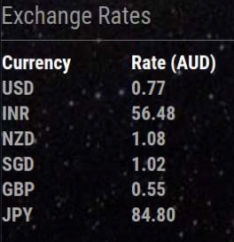

## MMM-ExchRate

This module is based on MMM-LICE by Mykle1. I have updated the API which is free but not limited to USD as base and also you get 1500 call per month. 

## What you get

* Real-time exchange rate for 168 World Currencies

* 1500 free calls per month with free plan and not limited to USD as source

* Annotated .css file included for coloring text and header.

## Examples

Many or few. You choose!

## Installation

* `git clone https://github.com/bpcode/MMM-ExchRate` into the `~/MagicMirror/modules` directory.

* Get your free API Access Key from https://www.exchangerate-api.com (Free plan)

* No dependencies needed! No kidding!

## Config.js entry and options

    {
        module: 'MMM-ExchRate',
        position: 'top_left',                 // Best in left, center, or right regions
	header: "Exchange Rate",
        config: { 
			accessKey: "Your API Access Key", // Free account & API Access Key
			source: "AUD",                    // or whatever is your source currency
			symbols: ["USD","CHF","EUR","GBP"]       // Currency symbols as array
			useHeader: false,                 
			header: "Show me the money",
			maxWidth: "300px",
        }
    },
	
